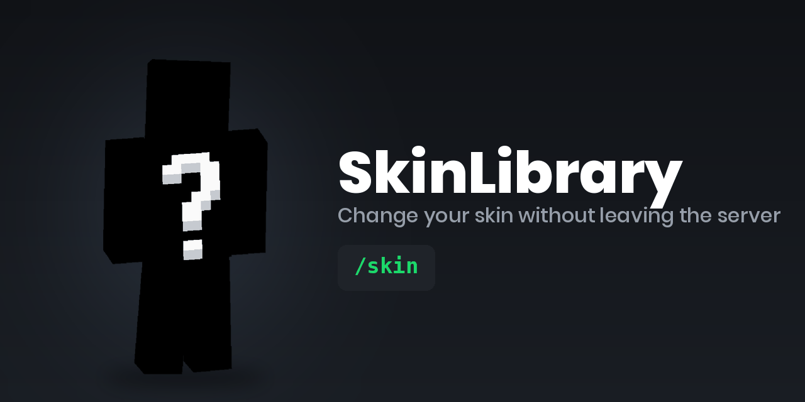
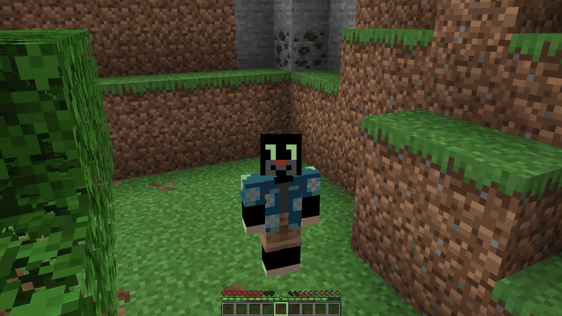

<div align="center">

<sub><b>Polski</b> · <a href="README.en.md">English</a></sub>

<sub><a href="CHANGELOG.md">Historia zmian</a></sub>

# 🎭 SkinLibrary

**Serwerowa biblioteka skinów dla Fabrica — gracz wybiera skin z klikalnej listy na czacie.**

Wrzucasz pliki `.png` do folderu, gracz wchodzi zwykłym klientem i wpisuje `/skin`.
Nic do zainstalowania po stronie gracza, żadnego własnego serwisu WWW ani kluczy API.

[](../../releases/latest)
&nbsp;

&nbsp;




</div>

---

## Co to robi

| Komenda | Co się dzieje |
|---|---|
| `/skin` | Przegląda bibliotekę — strony, grupowanie po autorze, pozycje są klikalne |
| `/skin <nazwa>` | Zakłada skin z biblioteki |
| `/skin random` | Zakłada losowy |
| `/skin player <nick>` | Zakłada skin dowolnego konta Minecraft |
| `/skin url <adres>` | Zakłada skin z linku do PNG |
| `/skin reset` | Wraca do skina własnego konta |
| `/skin reload` | Przeładowuje bibliotekę (operatorzy) |

Samą podmianę skina i wysyłkę do MineSkin robi
[FabricTailor](https://modrinth.com/mod/fabrictailor); SkinLibrary dokłada do tego
gotową bibliotekę i przeglądarkę na czacie.

## Jak to wygląda

Materiały trzymamy w [`docs/media/`](docs/media/) — nazwy plików są już podpięte poniżej,
po wrzuceniu nagrania wystarczy odkomentować odpowiednią linię
(instrukcja nagrywania: [docs/media/README.md](docs/media/README.md)).



<!--  -->
<!-- Dłuższe demo (.mp4) wgraj do wydania albo przeciągnij do zgłoszenia i wklej tu link. -->

## Funkcje

- 🖱️ **Klikalna lista na czacie** — stronicowana, grupowana po autorze, z nawigacją
  „◀ Poprzednia / Następna ▶" i skrótami 🎲 Losowy / ↺ Oryginalny.
- ⌨️ **Podpowiedzi (tab-complete)** nazw skinów — nie trzeba pamiętać, co jest w bibliotece.
- 📁 **Biblioteka to zwykły folder** — nazwa pliku staje się nazwą skina, `/skin reload` i gotowe.
- 🌐 **Skiny spoza biblioteki** — `/skin player <nick>` i `/skin url <adres>`, jedno i drugie
  można wyłączyć w konfiguracji.
- 🧠 **Cache tekstur** — raz pobrana tekstura nie leci do MineSkin drugi raz.
- 🗣️ **Tłumaczenia** — `en_us` i `pl_pl` w środku, własny język bez przebudowy jara.
- 📦 **Jeden jar na 1.21–1.21.10** — bez mixinów, bez buildu pod każdą wersję.
- 🔌 **Opcjonalny katalog po HTTP** (`libraryUrl`) — jeśli już masz własny serwis ze skinami.

## Wymagania

Serwer Fabric **od 1.21 do 1.21.10**, Java 21, a w `mods/`:
[Fabric API](https://modrinth.com/mod/fabric-api) i [FabricTailor](https://modrinth.com/mod/fabrictailor).

Mod jest wyłącznie serwerowy — gracze łączą się niezmodowanym klientem.

## Szybki start

1. Wrzuć `fabric-api`, `fabrictailor` i `skinlibrary` do folderu `mods/` serwera.
2. Uruchom serwer raz — utworzy `config/skinlibrary/`.
3. Wrzuć skiny `.png` (64×64 albo 64×32) do `config/skinlibrary/skins/`.
4. `/skin reload` i są dostępne.

Nazwa pliku staje się nazwą skina: `pirat.png` → `/skin pirat`.

## Konfiguracja

`config/skinlibrary/config.json`, tworzony przy pierwszym starcie:

```json
{
  "language": "en_us",
  "allowPlayerSkins": true,
  "allowUrlSkins": true,
  "cooldownSeconds": 5,
  "requireOperator": false,
  "pageSize": 8,
  "slimByDefault": false,
  "libraryUrl": "",
  "commandAliases": ["skin", "skins"]
}
```

Nic tu nie jest wymagane — domyślne wartości działają. Warte uwagi:

- **`commandAliases`** — zmiana nazwy komendy, gdy `/skin` zajmuje już inny mod.
- **`slimByDefault`** — traktuje skiny z plików jako model smukły (Alex).
- **`libraryUrl`** — opcjonalny katalog po HTTP, jeśli już taki prowadzisz. Musi odpowiadać
  `{"skins": [{"name": "...", "value": "...", "signature": "...", "author": "..."}]}`;
  zamiast `value` wpis może podać `url`.

### Bogatsze wpisy

Na wszystko poza „PNG w folderze" jest `config/skinlibrary/skins.json`:

```json
{
  "notch":  { "player": "Notch",                      "author": "mojang" },
  "banner": { "url": "https://example.com/skin.png",  "author": "alice"  },
  "alex":   { "file": "alex.png", "slim": true,       "author": "bob"    }
}
```

Wpisy są w przeglądarce grupowane po `author`, więc na wspólnym serwerze widać, kto co dodał.

### Tłumaczenia

W środku: `en_us`, `pl_pl` — wybierasz polem `language`.

Własny język: wrzuć `config/skinlibrary/lang/<kod>.json` z tymi samymi kluczami co
[`en_us.json`](src/main/resources/assets/skinlibrary/lang/en_us.json) — bez przebudowy jara.

## Wersje Minecrafta

Jeden jar obsługuje **1.21 – 1.21.10**. Mod nie ma mixinów i trzyma się z dala od tych części
API, które zmieniają się między wydaniami, więc nie wymaga buildu pod każdą wersję.

Jedyny wyjątek to klikalny czat: Minecraft 1.21.5 wymienił API zdarzeń kliknięcia/najechania.
Na 1.21.5+ lista jest klikalna, na starszych wydaniach ta sama lista wypisuje się bez klikania,
a reszta działa bez zmian.

## Budowanie

```bash
./gradlew build              # wymaga Java 21
python3 tools/check_lang.py  # klucze komunikatów zgodne we wszystkich językach
```

Jar ląduje w `build/libs/`.

## Zgłaszanie błędów

Błędy i propozycje zbieramy w [zakładce Issues](https://github.com/PiotrKajor/SkinLibrary/issues).
Formularz zgłoszenia sam pyta o to, co potrzebne: wersję moda, wersję Minecrafta, loader
i fragment logu.

Do zgłoszenia dołącz **`logs/latest.log` z serwera** — bez niego zwykle nie da się nic
ustalić. Gdy serwer się wywalił, dorzuć też plik z `crash-reports/`. Jeśli komenda kończy
się komunikatem „An unexpected error occurred", ślad po niej jest właśnie w logu serwera,
a nie na czacie.

## Licencja

[MIT](LICENSE).
